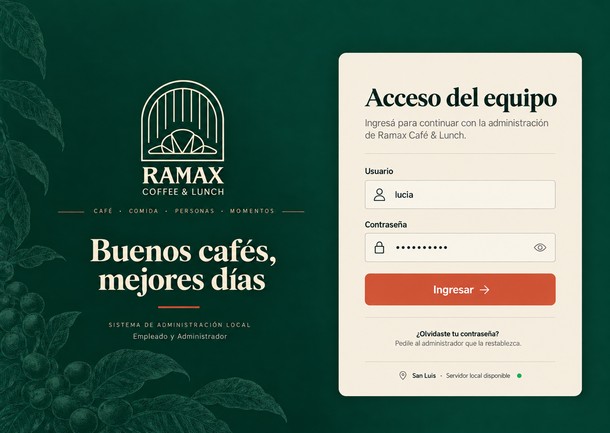
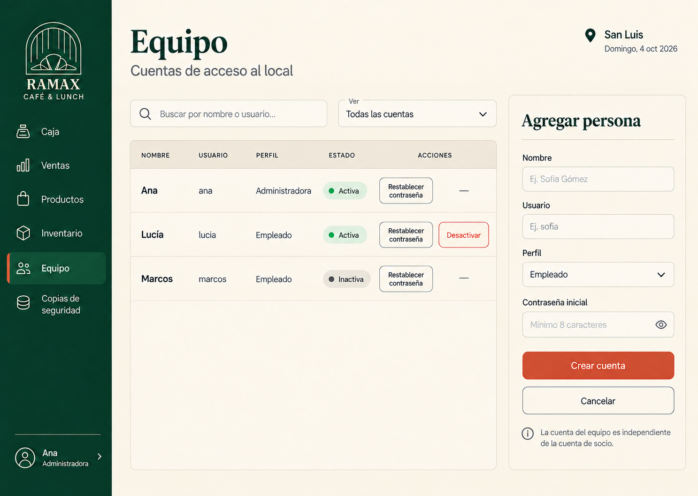
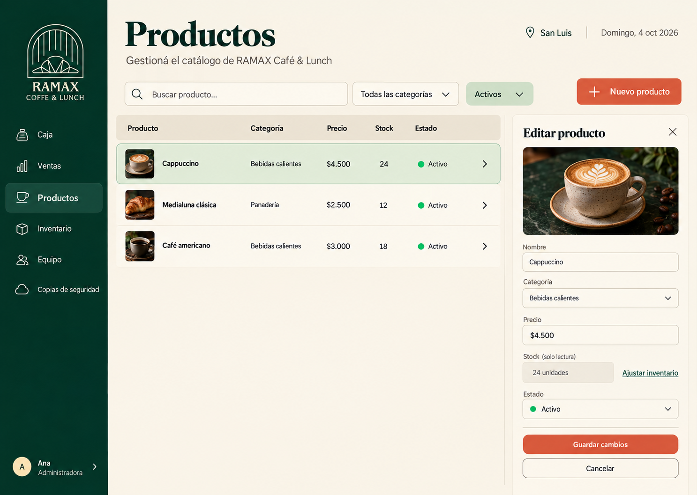
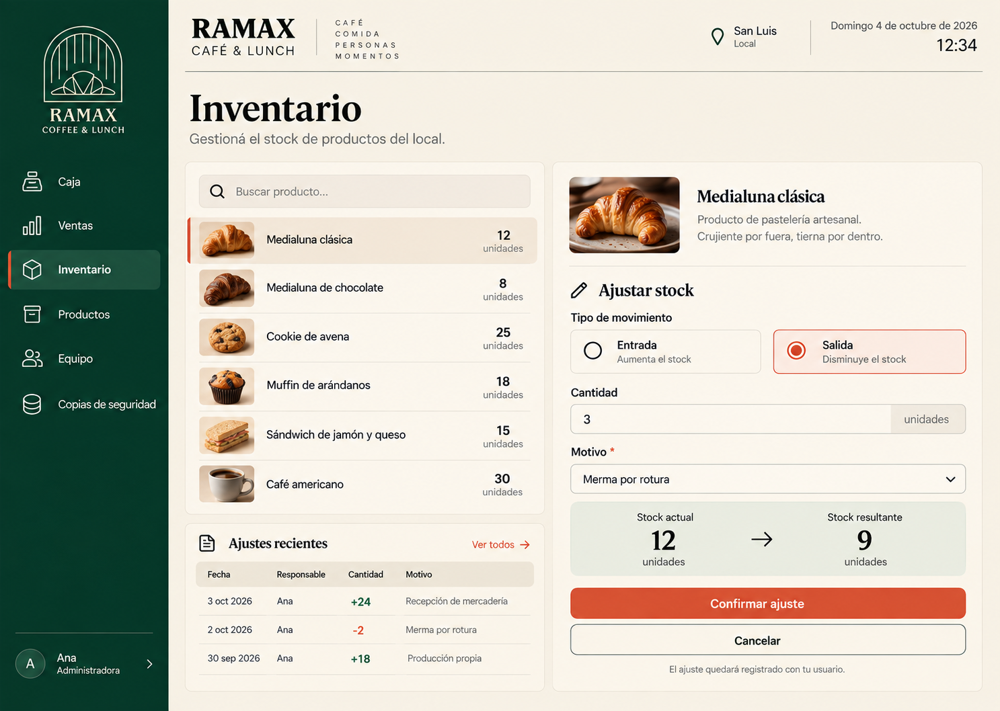
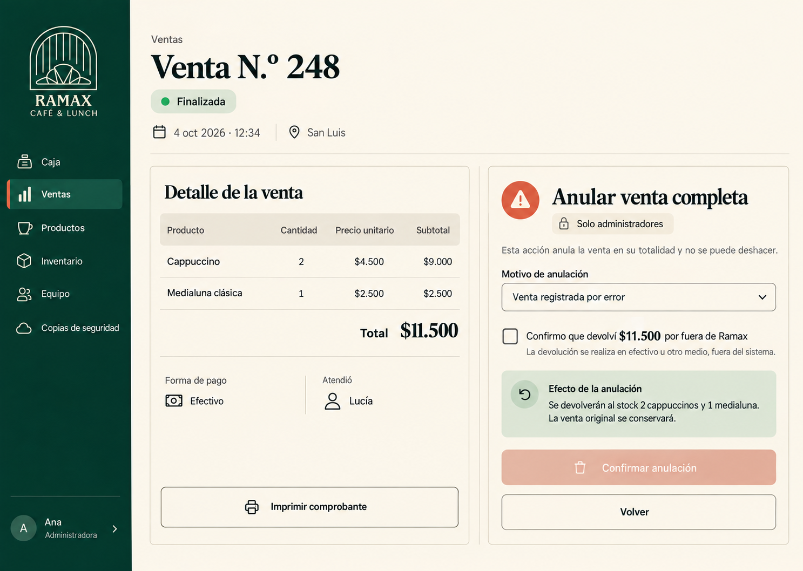
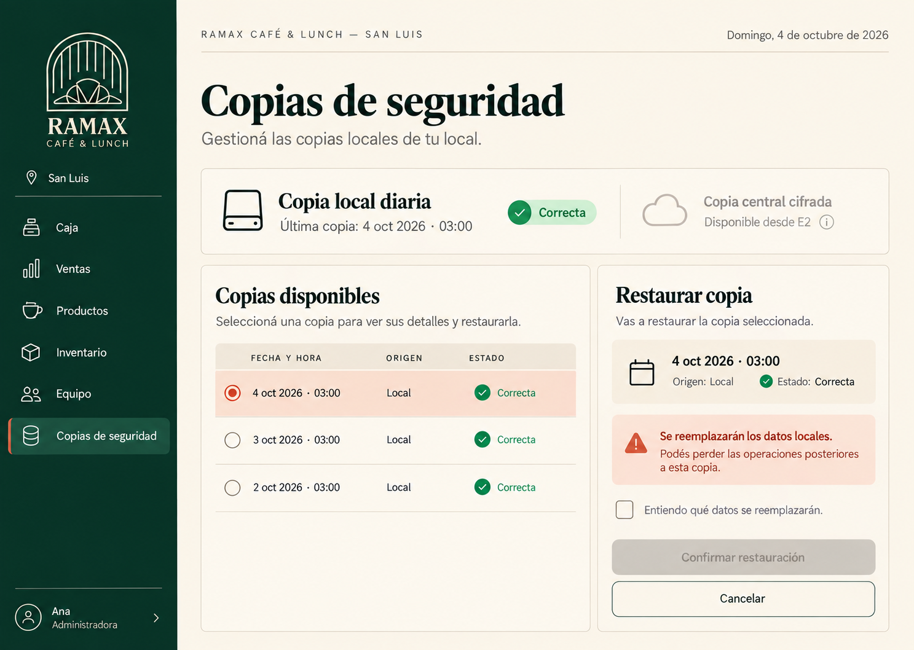

# Administración local · E0 y E1

Seis nuevas maquetas de escritorio basadas en la [guía visual](../app-socio/00-guia-estilo.png). Complementan las pantallas existentes de [caja](../app-equipo/README.md). Son imágenes estáticas con datos ficticios; no constituyen una aplicación funcional. Generadas con la herramienta integrada Image Gen el 4 de octubre de 2026.

## E0 · Acceso

### 01. Acceso del personal

Empleado y Administrador ingresan con contraseña local. Sin Google ni registro público. Recuperación mediante el Administrador.

### 02. Gestión del personal

Administrador: búsqueda, perfiles fijos, estado, alta y restablecimiento. Cuentas laborales separadas de membresías. La maqueta oculta desactivación para la cuenta actual y para cuentas ya inactivas. Antes de implementar, confirmar política de contraseñas: el placeholder de ocho caracteres es ilustrativo.

## E1 · Operación local

### 03. Administración de productos

Administrador: catálogo, precio en pesos enteros, estado y edición. Stock de consulta con acceso al ajuste. Empleado solo consulta.

### 04. Ajuste de inventario

Administrador: entrada/salida, cantidad, motivo y vista previa. Se registra responsable. El ajuste no permite stock negativo. El historial corresponde al producto seleccionado.

### 05. Detalle y anulación de venta

Empleado consulta e imprime; solo Administrador ve la anulación. Motivo obligatorio y confirmación de devolución externa. Anulación completa, restitución de stock y conservación de la venta original. La maqueta representa E1: el bloque de socio/puntos se incorpora desde E2, incluyendo reversión y posible saldo negativo.

### 06. Backup y restauración

Administrador: copia local diaria, selección de copia y confirmación explícita de restauración. La copia central cifrada se incorpora desde E2. La etiqueta de entrega E2 es una anotación de alcance de la maqueta; en la interfaz final no se debe mostrar terminología del plan al usuario.

## Revisión visual

Se inspeccionaron las seis imágenes: contenido legible, formularios visibles, importes coherentes ($9.000 + $2.500 = $11.500) y ajuste correcto (12 - 3 = 9). Se corrigió la acción de desactivar una cuenta ya inactiva. Las imágenes mantienen la identidad Ramax; al implementar se deben unificar ancho y orden del menú e iconos, que presentan pequeñas variaciones entre generaciones.

Los estados de error, carga y éxito y los diálogos de restablecimiento/desactivación deben desarrollarse en el prototipo interactivo. Las maquetas no verifican teclado, accesibilidad semántica ni comportamiento responsive.

## Prompts de generación

Referencias adjuntas: guía visual y pantalla Caja. Formato solicitado: escritorio 1440 × 1024. Motor: Image Gen integrado, sin CLI.

### Dirección compartida

Use case: ui-mockup. Create one production-quality desktop UI mockup for RAMAX Café & Lunch local administration, target 1440x1024 landscape. Reference images are brand/style grounding, not screens to reproduce. Match forest green #0B4A3B, deep green #063528, oat cream #F3E7D3, terracotta #D95A3B. Refined vintage serif headings and readable sans UI 14-16px. Strong contrast, generous spacing, clean realistic desktop app, no device/browser frame, no collage. Spanish Argentina exact readable copy. Date anchor 4 oct 2026. Consistent narrow deep-green left sidebar with RAMAX logo from reference, menu Caja, Ventas, Productos, Inventario, Equipo, Copias de seguridad; bottom Ana · Administradora. Cream main canvas and thin dividers, terracotta primary action, quiet secondary buttons. No campaigns, dashboards, cash closing, QR, loyalty screens. Single branch San Luis. Create focused screen described below.

### 01-acceso-personal

E0 Acceso del personal. Exception: no sidebar on login. Full forest green background, RAMAX logo and serif welcome on left, elegant cream login card on right, title "Acceso del equipo". Labeled fields "Usuario" value lucia and "Contraseña" masked with eye icon, wide terracotta "Ingresar". Secondary text "¿Olvidaste tu contraseña? Pedile al administrador que la restablezca." Footer "San Luis · Servidor local disponible". Small supporting text "Empleado y Administrador". No Google, no signup, no invented credentials. Calm professional layout.

### 02-gestion-personal

E0 Gestión del personal, menu Equipo selected. Title "Equipo" subtitle "Cuentas de acceso al local". Main area left table name/usuario/perfil/estado for Ana admin active, Lucía employee active, Marcos employee inactive. Search and active filter. Right cream panel "Agregar persona" with fields Nombre, Usuario, Perfil dropdown Empleado, Contraseña inicial eye icon; buttons "Crear cuenta", "Cancelar". Text "La cuenta del equipo es independiente de la cuenta de socio." Table row has clearly labeled actions Restablecer contraseña and Desactivar, restrained, no delete. Keep table and panel readable, no overlap.

### 03-administracion-productos

E1 Productos, menu Productos selected. Header "Productos", search "Buscar producto", category filter and active filter. Main table columns Producto, Categoría, Precio, Stock, Estado. Rows Cappuccino Bebidas calientes $4.500 24 Activo, Medialuna clásica Panadería $2.500 12 Activo, Café americano Bebidas calientes $3.000 18 Activo. Right edit panel title "Editar producto", small real cappuccino photo matching brand, field Nombre Cappuccino, category dropdown Bebidas calientes, Precio $4.500, Estado Activo. Stock read-only "24 unidades", link "Ajustar inventario". Primary "Guardar cambios", secondary Cancelar. No stock editable in product form, no cents or discount.

### 04-ajuste-inventario

E1 Inventario, menu Inventario selected. Title "Inventario". Selected product Medialuna clásica with small tasteful pastry photo. Left compact searchable product list with stock counts and lower recent adjustments table date/responsable/cantidad/motivo. Main right form "Ajustar stock", radio Entrada / Salida with Salida selected, Cantidad 3, mandatory Motivo "Merma por rotura". Prominent preview "Stock actual: 12 → Stock resultante: 9 unidades". Primary "Confirmar ajuste", secondary Cancelar. Small line "El ajuste quedará registrado con tu usuario." History example 3 oct 2026 Ana +24 Recepción; 2 oct 2026 Lucía must NOT make adjustment since employee unauthorized; use Ana -2 Merma. Avoid negative stock and value-money inventory.

### 05-detalle-anulacion-venta

E1 Detalle y anulación de venta. Menu Ventas selected. Title "Venta N.º 248", status Finalizada, date 4 oct 2026 · 12:34. Receipt table 2 Cappuccinos $4.500 unit $9.000 subtotal, 1 Medialuna clásica $2.500, total $11.500. Payment Efectivo, Atendió Lucía. Secondary "Imprimir comprobante". Right panel cream "Anular venta completa", admin-only label, mandatory reason "Venta registrada por error". Unchecked checkbox "Confirmo que devolví $11.500 por fuera de Ramax". Clear effect "Se devolverán al stock 2 cappuccinos y 1 medialuna. La venta original se conservará." Muted destructive button "Confirmar anulación" disabled until checkbox and reason valid, secondary "Volver". No partial refund, no integrated refund, no loyalty because strict E1 local screen. No modal obscuring receipt; aligned two-column review.

### 06-backup-restauracion

E1 Copias de seguridad. Menu Copias de seguridad selected. Title "Copias de seguridad". Top status "Copia local diaria" with "Última copia: 4 oct 2026 · 03:00", status Correcta. Small quiet note "Copia central cifrada disponible desde E2", not enabled and not claiming uploaded backups. Available copies table 4 oct 2026 03:00 Local Correcta selected; 3 oct 2026 03:00 Local Correcta; 2 oct 2026 03:00 Local Correcta. Right panel "Restaurar copia" selected "4 oct 2026 · 03:00". Clear warning "Se reemplazarán los datos locales. Podés perder las operaciones posteriores a esta copia." Unchecked confirmation "Entiendo qué datos se reemplazarán", muted disabled "Confirmar restauración", "Cancelar". No fake backup storage capacity metrics, no cloud active in E1, no deletion controls. Clean spacious hierarchy.

### Corrección de personal

Conservar la imagen y retirar Desactivar de las filas Marcos (inactivo) y Ana (cuenta actual), reemplazándolo por un guion neutro. Mantener la acción para Lucía.
