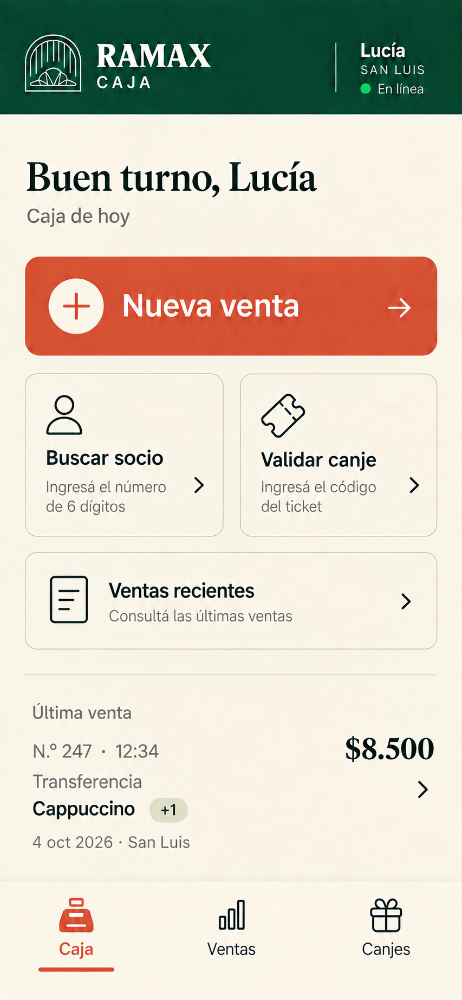
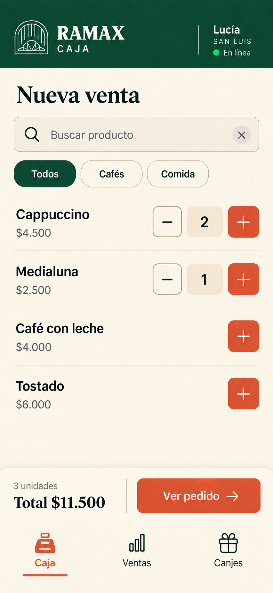
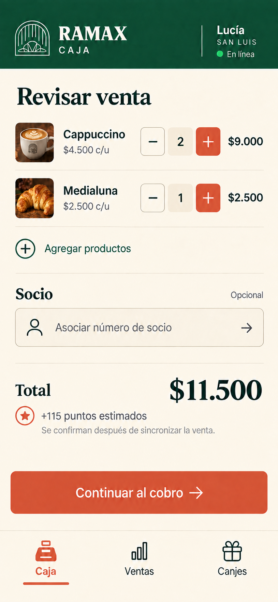
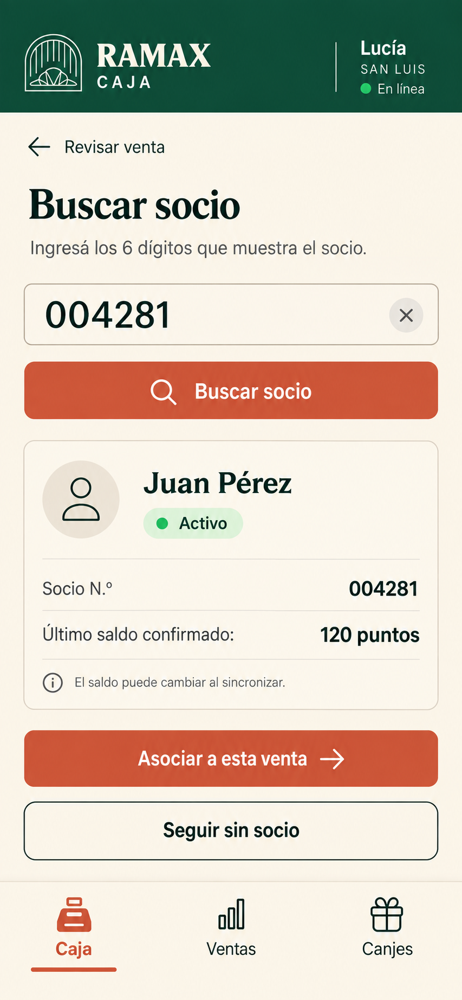
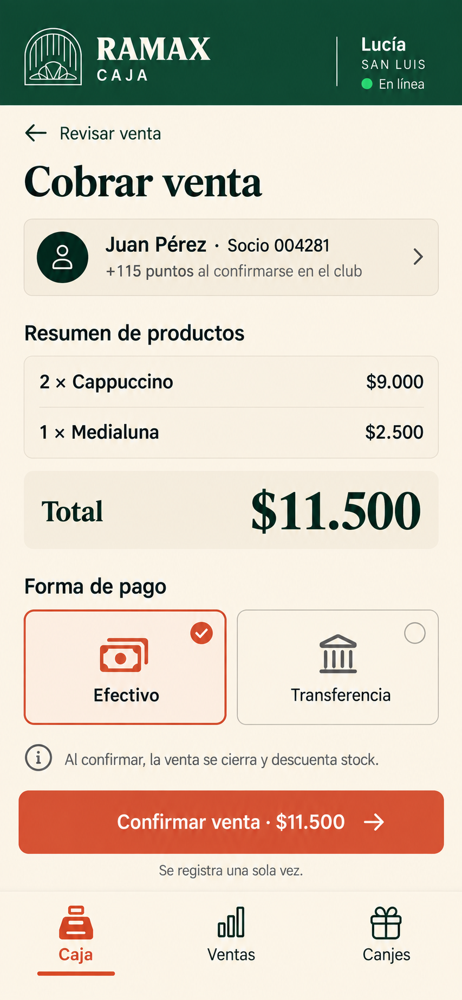
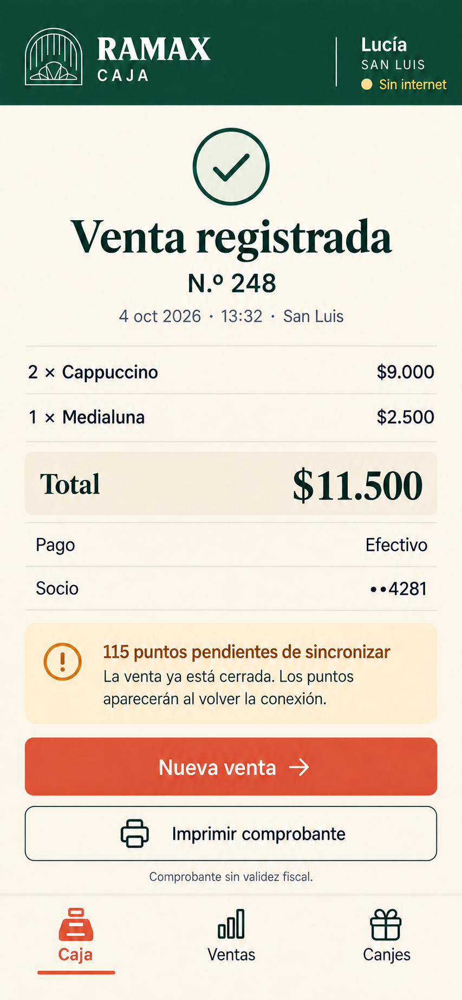
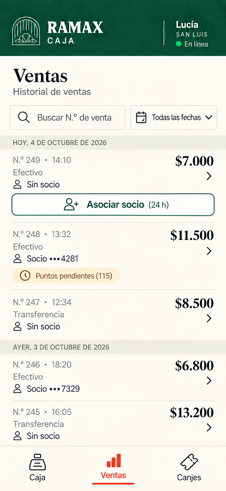
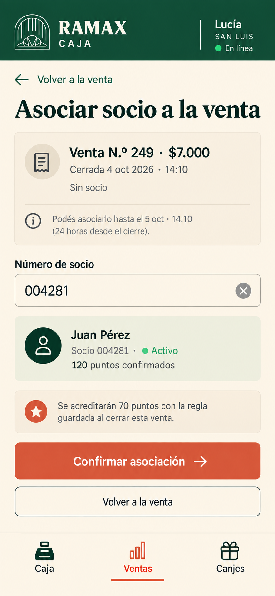
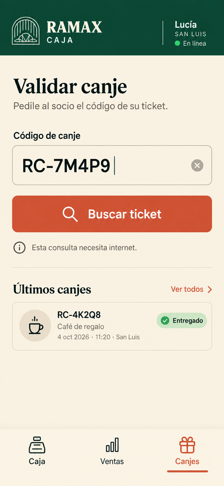
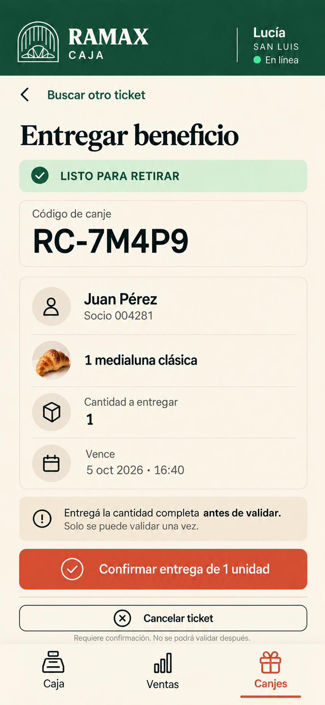

# App móvil del equipo: caja · MVP

Diseños basados en la [guía de estilo de Ramax](../app-socio/00-guia-estilo.png), el [MVP funcional](../../RAMAX_CAFE_CLUB_MVP.md) y el [glosario](../../../CONTEXT.md). Son maquetas visuales con datos de ejemplo; no son pantallas funcionales.

## Venta en caja · Empleado

```text
Caja → Nueva venta → Revisar venta → Buscar socio (opcional)
                                      ↓
                        Cobrar venta → Venta registrada
                                      ↓
                         Ventas → Asociación tardía
```

| Caja y carga rápida | Revisión y socio |
| --- | --- |
| [](./01-caja.png) | [](./02-productos-venta.png) |
| Acción principal a mano; última venta con número, total y productos | Búsqueda, cantidades y total fijo al pie |
| [](./03-revisar-venta.png) | [](./04-buscar-socio.png) |
| Ítems, total y asociación opcional | Búsqueda solo por número de seis dígitos |
| [](./05-cobrar-venta.png) | [](./06-venta-registrada.png) |
| Efectivo o transferencia, confirmación única | Comprobante y puntos pendientes si no hay internet |
| [](./07-ventas.png) | [](./08-asociacion-tardia.png) |
| Historial completo, filtro por fecha y botón para asociar socio | Vínculo dentro de las 24 horas posteriores |

La venta de ejemplo contiene dos cappuccinos de $4.500 y una medialuna de $2.500. Total: **$11.500**. La regla ilustrativa de un punto cada $100 genera **115 puntos**.

En Caja y en Ventas, cada ítem muestra número y hora a la izquierda e importe a la derecha. La última venta también muestra el primer producto con `+N` para los demás productos distintos. “Asociar socio” conserva un botón de ancho completo.

En [Revisar venta](./03-revisar-venta.png), los puntos son **estimados** hasta sincronizar. La búsqueda muestra el [estado sin conexión para un socio no guardado](./04b-socio-sin-conexion.png): la venta puede cerrarse sin socio y asociarse cuando vuelva internet, dentro de las 24 horas. Los socios guardados en el dispositivo sí pueden asociarse sin conexión.

## Canjes en caja · Empleado

| Buscar ticket | Entregar beneficio |
| --- | --- |
| [](./09-buscar-canje.png) | [](./10-entregar-beneficio.png) |
| Entrada por código manual | Validación única de la cantidad completa |

El ejemplo usa el ticket `RC-7M4P9`. Su consulta y validación requieren conexión. “Canjear promociones” se interpreta aquí como entregar un beneficio solicitado por el socio; no se aplica un descuento al precio de una venta.

La búsqueda contempla cuatro resultados sin entrega posible: [código inexistente](./09b-codigo-inexistente.png), [ticket vencido](./09c-ticket-vencido.png), [cancelado](./09d-ticket-cancelado.png) y [ya utilizado](./09e-ticket-utilizado.png). [Cancelar ticket](./10-entregar-beneficio.png) está separado de confirmar la entrega y abre una [confirmación explícita](./10b-confirmar-cancelacion.png).

Los diseños de campañas y dashboards se conservan en una [galería futura separada](../futuro-admin/README.md); no forman parte de la navegación del MVP. La administración normal de recompensas es otra función.

## Reglas que debe conservar la implementación

- La persona de caja ve nombre, estado y último saldo confirmado del socio. No ve email, teléfono ni historial de puntos.
- La venta se cierra una sola vez. No permite descuento, cambio de precio, pago dividido ni stock negativo. Puede cerrarse sin internet o sin socio.
- La operación local conserva ventas y comprobantes aunque falle el club. Los puntos pendientes no forman parte del saldo disponible hasta confirmarse.
- Una venta sin socio puede asociarse durante las 24 horas posteriores al cierre. El canje usa un código manual, requiere internet y se valida una sola vez al entregar la cantidad completa.
