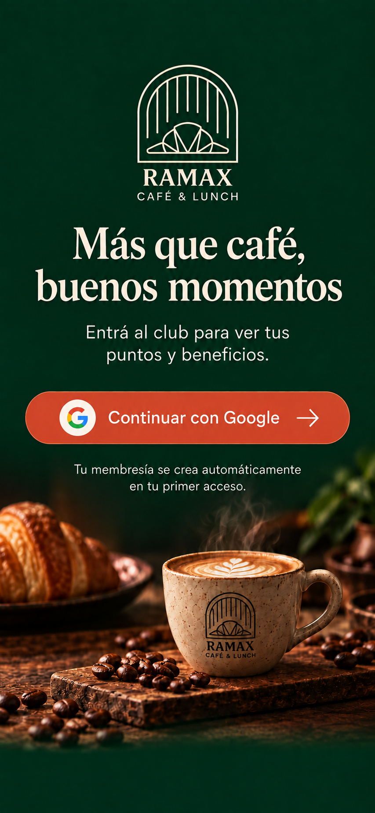
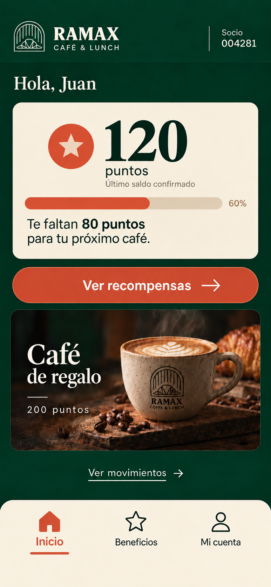
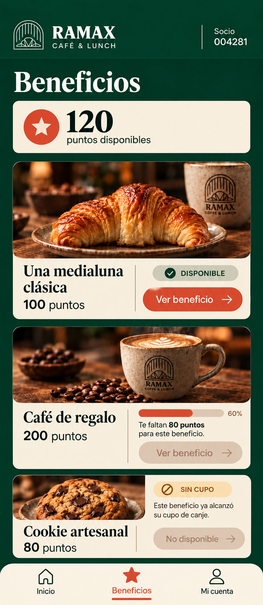
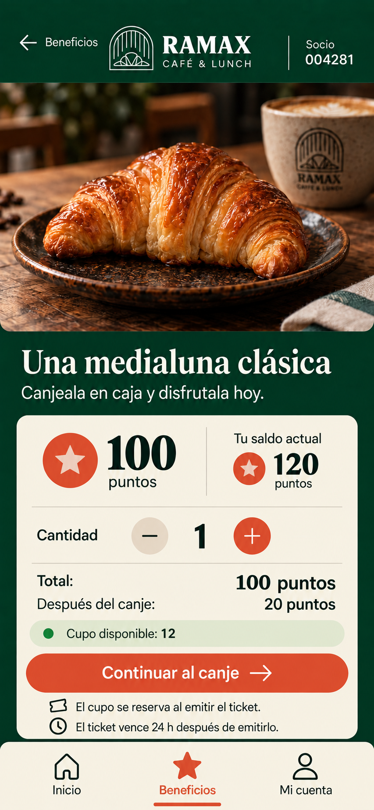
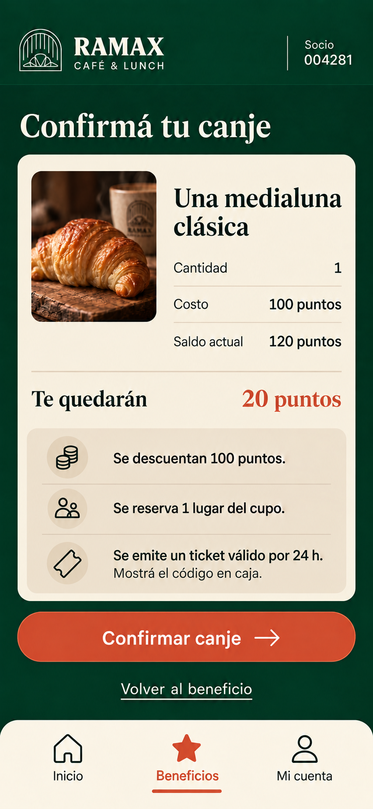
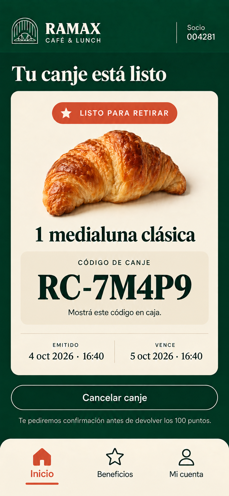
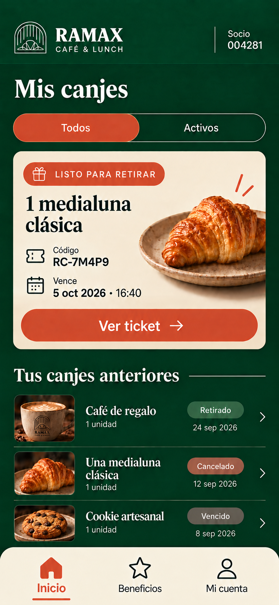
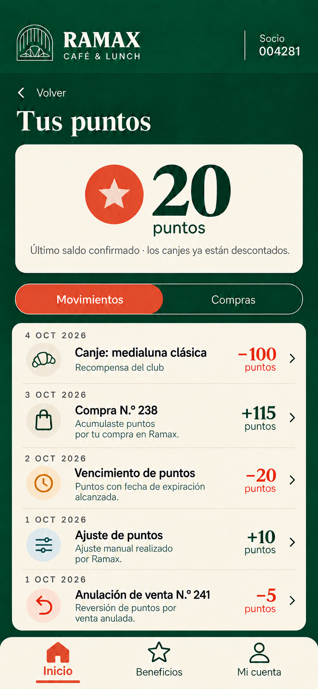
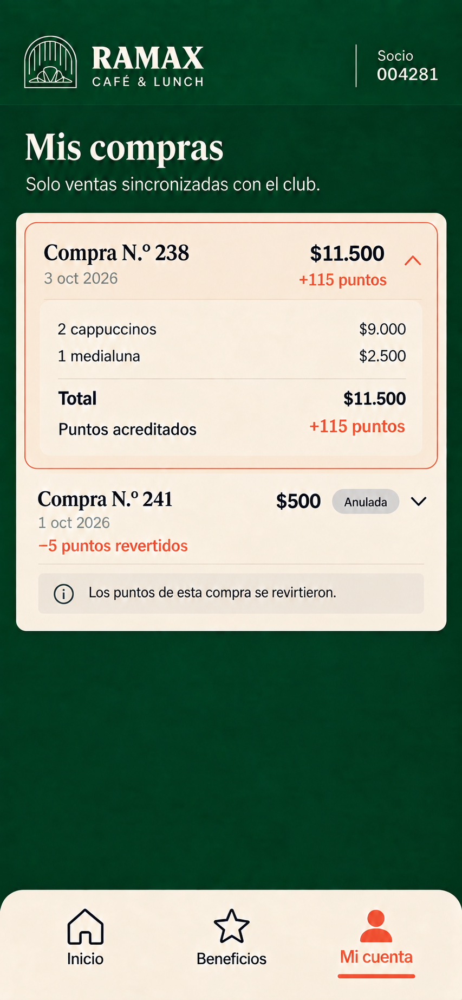
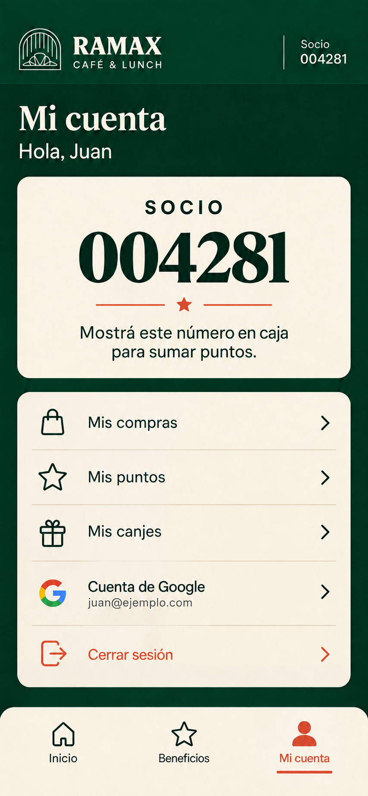

# App del socio: diseño móvil

Propuesta visual basada en la [guía de estilo de Ramax](./00-guia-estilo.png) y el [MVP](../../RAMAX_CAFE_CLUB_MVP.md). Las imágenes son maquetas de diseño; muestran datos de ejemplo y todavía no representan pantallas funcionales.

## Recorrido

```text
Acceso con Google → Inicio → Beneficios → Detalle → Confirmación → Ticket
                    │                                      │
                    ├→ Movimientos → Mis compras            └→ Mis canjes
                    └→ Mi cuenta ────────────────→ Mis canjes / Compras / Puntos
```

| Acceso e inicio | Descubrir beneficios |
| --- | --- |
| [](./01-acceso.png) | [](./02-inicio.png) |
| Solo Google para socios; el equipo usa su panel local | Último saldo confirmado, progreso y próxima recompensa |
| [](./03-beneficios.png) | [](./04-detalle-beneficio.png) |
| Disponible, puntos insuficientes y sin cupo | Cantidad, costo y cupo antes de canjear |

| Canjear | Consultar actividad |
| --- | --- |
| [](./05-confirmar-canje.png) | [](./06-ticket-canje.png) |
| Descuento de puntos, reserva de cupo y ticket inicial de 24 h | Código manual, cantidad y vencimiento visibles en caja |
| [](./07-mis-canjes.png) | [](./08-movimientos.png) |
| Activo, retirado, cancelado y vencido | Saldo y libro de puntos |
| [](./09-mis-compras.png) | [](./10-mi-cuenta.png) |
| Solo ventas sincronizadas, con anulación y reversión de puntos | Número de socio y accesos personales |

[Cancelar canje](./06-ticket-canje.png) abre una [confirmación](./06b-confirmar-cancelacion.png) antes de devolver puntos y liberar cupo. Los movimientos incluyen un [estado de saldo negativo](./08b-saldo-negativo.png).

## Criterios para implementar

- Encabezado compacto en verde profundo, superficies crema, acción principal terracota y navegación inferior de tres destinos: Inicio, Beneficios y Mi cuenta.
- El número de socio identifica a la persona en caja; no da acceso a su cuenta. El ticket de canje usa un código manual distinto.
- El número de socio de ejemplo es `004281` en todas las pantallas; el saldo mostrado es el último confirmado. El ejemplo parte de 120 puntos: una medialuna cuesta 100 y deja 20; un café de 200 muestra que faltan 80 antes del canje. La cookie de 80 puntos ilustra la falta de cupo, independiente del saldo.
- En el MVP, el ticket vence 24 horas después de emitirse y una cancelación previa a la validación devuelve los puntos.
- Reemplazar fotografías y datos de ejemplo por contenido real antes de publicar. Incorporar estados de carga, sin datos y sin conexión al implementar.
